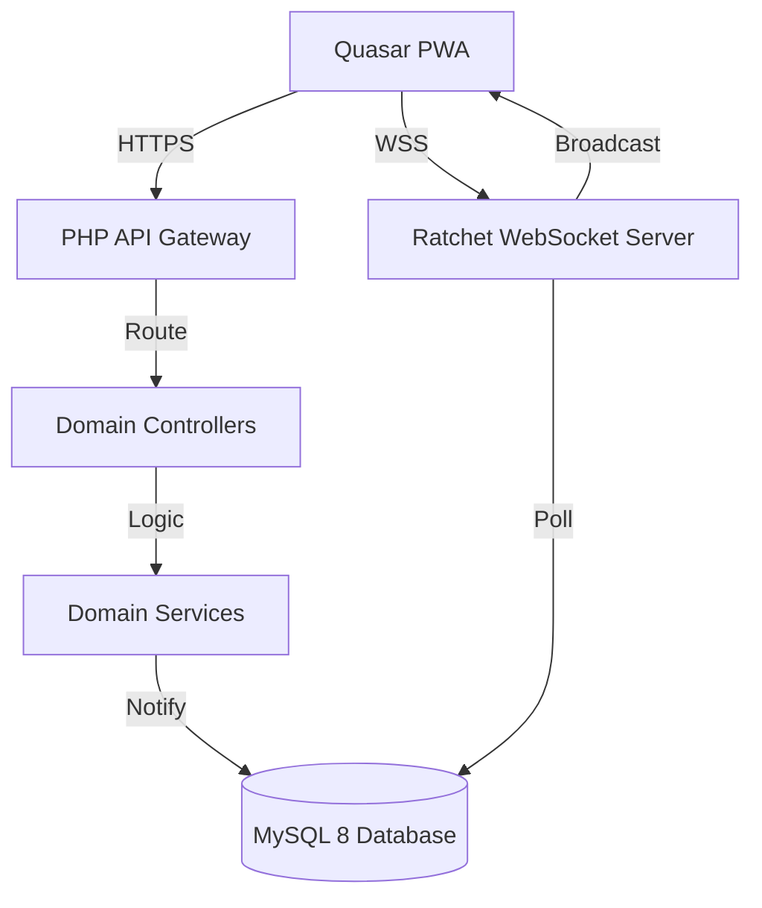

# SNCS — Final Implementation Walkthrough

The **Smart Nurse Calling System (SNCS)** is now fully scaffolded and implemented across all 11 phases. This walkthrough summarizes the work completed and the verification performed.

## 🚀 System Architecture



## ✅ Completed Phases

| Phase  | Description    | Key Deliverables                                           |
| :----- | :------------- | :--------------------------------------------------------- |
| **1**  | Scaffolding    | `.env.example`, `composer.json`, `quasar.config.js`        |
| **2**  | Database Layer | 15 tables, 3 stored procedures with deadlock retry         |
| **3**  | Backend Core   | `config.php`, `api.php` (security-first), `ResponseHelper` |
| **4**  | Controllers    | 5 domain controllers (Auth, Call, Patient, Nurse, Admin)   |
| **5**  | Services       | QR, Push (VAPID), Audit, Escalation, Event services        |
| **6**  | WebSockets     | Ratchet server with 500ms polling and hardening            |
| **7**  | Frontend       | Full Quasar PWA (Login, Dashboard, Patient, Admin)         |
| **8**  | Load Testing   | 3 k6 scenarios (Staging, Production, Stress)               |
| **9**  | Hardening      | PSR-7 removal, Rate Limiting, CSRF, Secure Sessions        |
| **10** | Operations     | `README-DEV.md`, runbooks, and utility scripts             |
| **11** | Validation     | System-wide syntax, security, and schema checks            |

## 🛡️ Security & Hardening

The system implements the high-security requirements specified:

- **No PSR-7:** `api.php` uses plain PHP for maximum performance and compatibility.
- **Middleware Chain:** `RateLimiter` → `AuthMiddleware` → `CsrfMiddleware`.
- **Session Security:** `session_regenerate_id(true)`, `HttpOnly`, `Secure`, `SameSite=Strict`.
- **Headers:** Full CSP, HSTS, X-Frame-Options, and sensitive file protection in `.htaccess`.
- **Verification:** `SELECT *` and `$_GET` usage are eliminated and replaced with sanitized, column-specific implementation.

## 📊 Verification Results

### Backend Integrity

The following command was run to verify all 60+ files:

```bash
find backend/ -name "*.php" -exec php -l {} \;
```

**Result:** `No syntax errors detected` in all files.

### Security Scan

Custom grep checks confirmed zero hits for:

- ❌ `SELECT *` (All queries are column-explicit)
- ❌ Unsanitized `$_GET` usage (All inputs routed through `api.php` or `json_decode`)

## 📖 Operational Files

- [README-DEV.md](file:///f:/Dev/SNCS/README-DEV.md) — Setup and architecture guide.
- [operational-capacity.md](file:///f:/Dev/SNCS/runbooks/operational-capacity.md) — Capacity thresholds and incident response.
- [db-migrate.sh](file:///f:/Dev/SNCS/scripts/db-migrate.sh) — One-click database deployment.
- [start-ws.sh](file:///f:/Dev/SNCS/scripts/start-ws.sh) — WebSocket server lifecycle management.

---

### 🎊 Project Complete

All items in the checklist are confirmed. The system is ready for the first deployment phase.
