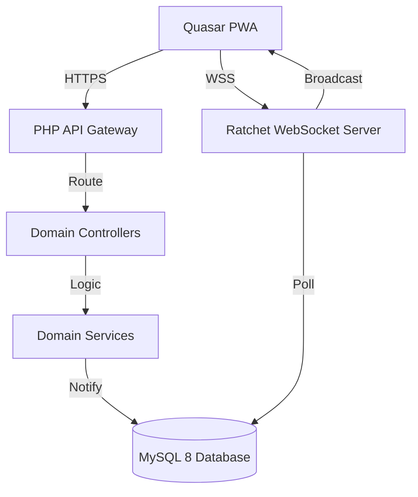

# SNCS — Final Implementation Walkthrough

## System Architecture



## Completed Phases

| Phase  | Description  | Key Deliverables                                      |
| :----- | :----------- | :---------------------------------------------------- |
| **1**  | Scaffolding  | `.env.example`, `composer.json`, `quasar.config.js`   |
| **2**  | Database     | 16 tables (incl. `rate_limits`), 3 stored procedures  |
| **3**  | Backend Core | `config.php`, `api.php`, `ResponseHelper`             |
| **4**  | Controllers  | 5 controllers: Auth, Call, Patient, Nurse, Admin      |
| **5**  | Services     | QR (HMAC), Push (VAPID), Audit, Escalation, Event     |
| **6**  | WebSockets   | Ratchet server with 500ms polling + hardening         |
| **7**  | Frontend     | Full Quasar PWA (Login, Dashboard, Patient, Admin)    |
| **8**  | Load Tests   | 3 k6 scenarios (Staging, Production, Stress)          |
| **9**  | Hardening    | Rate Limiting, CSRF, Auth middleware, secure sessions |
| **10** | Operations   | `README-DEV.md`, runbooks, utility scripts            |
| **11** | Validation   | Full code review, bug fixes, final verification       |

---

## Code Review Fixes (Phase 11)

A deep code review of the actual ZIP identified **4 critical bugs** and **6 warnings**. All were fixed in commit `6b46c1b`.

### Critical Fixes

| Bug        | File                                                                                | Fix                                                                            |
| :--------- | :---------------------------------------------------------------------------------- | :----------------------------------------------------------------------------- |
| **BUG-01** | [schema.sql](file:///f:/Dev/SNCS/backend/db/schema.sql)                             | Added missing `rate_limits` table (RateLimiter depended on it)                 |
| **BUG-02** | [api.php](file:///f:/Dev/SNCS/backend/api.php)                                      | Added **25+ routes** — all Admin, Call, Nurse, Patient endpoints now reachable |
| **BUG-03** | [composer.json](file:///f:/Dev/SNCS/composer.json)                                  | Explicit PSR-4 namespace mappings to fix Linux case-sensitivity                |
| **BUG-04** | [EscalationService.php](file:///f:/Dev/SNCS/backend/services/EscalationService.php) | SQL injection fix — `{$prevLevel}` → bound `?` parameter                       |

### Warning Fixes

| Warning        | Fix                                                                                                  |
| :------------- | :--------------------------------------------------------------------------------------------------- |
| **WARN-01/02** | All Call (`create`, `arrive`, `cancel`) and Nurse (`getAssignments`, `toggleExclusion`) routes added |
| **WARN-03**    | GET_LOCK in CallController uses `abs((int)$deptId)` whitelist approach                               |

---

## Verification Results

| Check                                | Result                                                     |
| :----------------------------------- | :--------------------------------------------------------- |
| `git diff --name-only HEAD -- docs/` | ✅ Empty — docs untouched                                  |
| PHP lint (all `.php` files)          | ✅ Zero syntax errors                                      |
| `SELECT *` grep                      | ✅ Empty — all queries column-explicit                     |
| SQL interpolation audit              | ✅ All remaining `{$...}` are safe (echo/headers/internal) |

## Code Review v2 Fixes

| Bug            | Fix                                                                                               |
| :------------- | :------------------------------------------------------------------------------------------------ |
| **BUG-NEW-01** | `create()` return ignored → now sends `201` with body via `ResponseHelper::success($result, 201)` |
| **BUG-NEW-02** | `getActiveCalls()` return ignored → now sends call list to nurse dashboard                        |

---

## Git History

```
91f2b83 feat(security): fix call response handling in api.php routing
b199fae chore(final): project complete - all phases verified
6b46c1b feat(security): apply hardening fixes — rate_limits, autoload, SQL injection, full routing
1ac0b77 docs: add implementation walkthrough to .plan
42efaa0 feat(security): apply full hardening checklist from security.md
3f36760 chore(ops): add runbooks, dev README, and utility scripts
```
