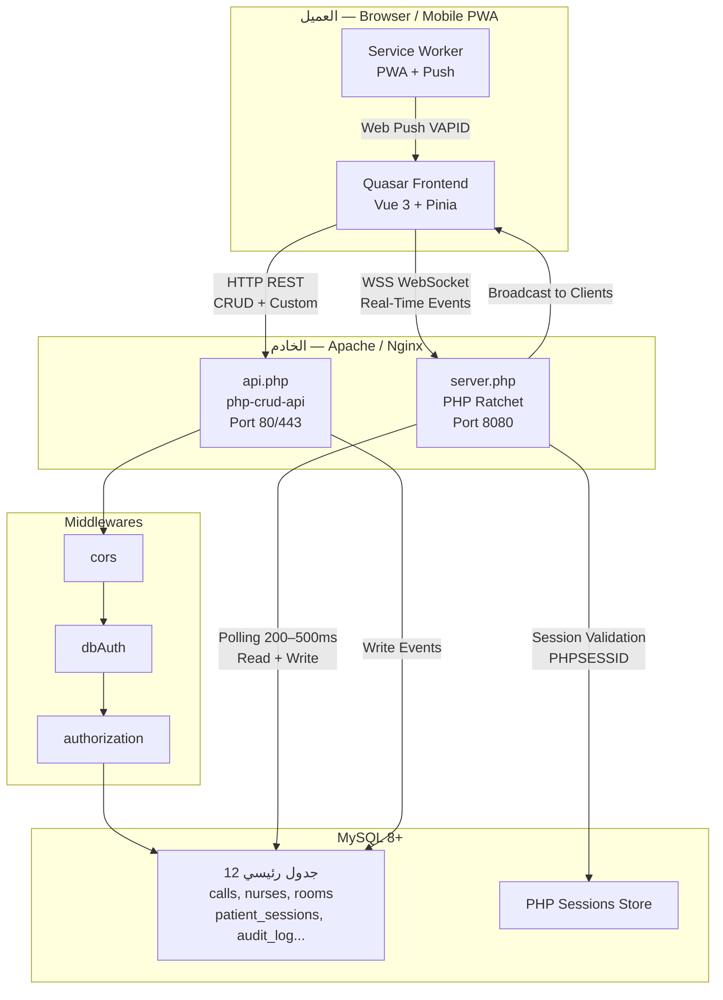

# الخريطة المعمارية — Technical Stack Map

## المكدس التقني (Stack Overview)

| الطبقة | التقنية | الدور في النظام |
|--------|---------|----------------|
| Frontend SPA/PWA | Quasar Framework v2 (Vue 3) | واجهة المستخدم الكاملة — RTL — Dark Mode — PWA — Push Notifications |
| Backend API | php-crud-api (PHP 8+) | REST API تلقائي لجداول CRUD + Custom Controllers للمنطق المعقد |
| Real-Time Engine | PHP Ratchet (ReactPHP) | WebSocket Server مستقل — يعمل جنباً إلى جنب مع Apache/Nginx |
| Database | MySQL 8+ | قاعدة البيانات الوحيدة — تخزين كل البيانات والجلسات |
| Auth System | dbAuth (php-crud-api built-in) | المصادقة عبر جدول users في MySQL — Session-based بدلاً من JWT |
| Middlewares | cors, dbAuth, authorization | حماية كاملة للـ API — تُطبَّق بالترتيب على كل طلب |
| Hosting | Apache / Nginx (Shared or VPS) | لا Docker — نشر مباشر على الخادم |
| PWA Push | Web Push Protocol + VAPID | إشعارات فورية للممرضين حتى خارج المتصفح |

> **قرار تصميمي:** اختير PHP Ratchet على Node.js Socket.io للحفاظ على مكدس PHP موحد وتبسيط النشر في بيئات المستشفيات. راجع [questions-for-owner.md](./questions-for-owner.md) للنقاشات المفتوحة.

---

## مخطط المعمارية (Mermaid Diagram)



---

## هيكل ملفات المشروع

| المسار | المحتوى والغرض |
|--------|---------------|
| `/backend/` | جذر الـ Backend — يُخدَّم على Apache/Nginx |
| `/backend/api.php` | نقطة الدخول لـ php-crud-api — يُحمِّل كل الـ Middlewares والـ Controllers |
| `/backend/config.php` | إعدادات قاعدة البيانات، المفاتيح السرية، VAPID keys |
| `/backend/middleware/` | مجلد الـ Middlewares: Cors.php, DbAuth.php, Authorization.php |
| `/backend/controllers/` | Custom Controllers — كل منطق لا يستطيع CRUD تنفيذه |
| `/backend/controllers/CallController.php` | إدارة دورة حياة النداءات + منطق التوزيع |
| `/backend/controllers/NurseController.php` | QR Scan، تفعيل الشفت، Exclusion Mode |
| `/backend/controllers/PatientController.php` | Guest Session، Presence Verification، Throttling |
| `/backend/controllers/DashboardController.php` | بيانات Live Tracker لكل مستوى صلاحية |
| `/backend/controllers/AuthController.php` | تسجيل الدخول/الخروج + بيانات الجلسة الحالية |
| `/backend/controllers/SettingsController.php` | إعدادات النظام العامة (Throttling، Verification Interval) |
| `/backend/websocket/server.php` | نقطة تشغيل Ratchet — يُشغَّل عبر: `php server.php` |
| `/backend/websocket/NursingApp.php` | MessageComponentInterface — منطق توجيه الرسائل |
| `/backend/websocket/RoomManager.php` | إدارة rooms/channels وقائمة المتصلين |
| `/backend/websocket/SessionValidator.php` | التحقق من صلاحية الجلسة عند الاتصال |
| `/backend/db/schema.sql` | هيكل الجداول الكامل (CREATE TABLE) |
| `/backend/db/relations.sql` | العلاقات والـ Foreign Keys |
| `/backend/db/seeds/` | مجلد بيانات التجربة (Demo Data) |
| `/frontend/src/pages/` | كل صفحات التطبيق |
| `/frontend/src/components/` | المكونات المشتركة (CallCard, NurseChip, RoomMap...) |
| `/frontend/src/stores/` | Pinia Stores (auth, calls, websocket) |
| `/frontend/src/composables/` | useWebSocket, useSound, useCallThrottle, useQRScanner |
| `/frontend/src-pwa/` | إعدادات PWA: manifest.json, service-worker.js |

---

## الهيكل الهرمي للبيانات

```
🏥 المستشفى (Hospital Level)
   المستوى الأول — إدارة المستشفى | رؤية كاملة | تقارير عليا
   │
   ├── 🏢 الأقسام (Department Level)
   │      المستوى الثاني — الباطنة | الجراحة | طوارئ | نساء | أطفال | ICU
   │      │
   │      └── 🚪 الغرف (Room Level)
   │             المستوى الثالث — رقم فريد | رمز QR | سجل نداءات | ممرض مُعيَّن
```

**قواعد عزل البيانات:**
- لا يمكن لممرض من قسم (أ) رؤية نداءات قسم (ب) مطلقاً.
- طابور التوزيع (Dispatch Queue) مستقل بالكامل لكل قسم.
- الغرفة لا يمكن أن تنتمي لأكثر من قسم واحد في آنٍ واحد.

---

## تدفق البيانات — Data Flow

```
[ Quasar PWA — المتصفح / الجهاز ]
       │
       ├── HTTP REST (port 80/443) ──→ [ api.php ] ──→ Middlewares ──→ MySQL
       │                                                     ↓
       │                                              Custom Controllers
       │
       └── WebSocket (port 8080 WSS) ──→ [ server.php — Ratchet ]
                                               │
                                     ┌─────────┴──────────┐
                                     │                    │
                              Session Validate      MySQL Polling
                              (PHPSESSID)           (200–500ms)
                                     │                    │
                              RoomManager          Read events
                              broadcastToDept      WHERE id > last_id
```

**آلية تكامل Ratchet مع php-crud-api:**
- API Server: Apache يُخدِّم `api.php` على المنفذ 80/443.
- WebSocket Server: Ratchet يعمل على المنفذ 8080، يُشغَّل كـ Daemon: `nohup php server.php &`
- التزامن: الـ API يكتب في MySQL، ثم Ratchet يقرأ التغيير عبر Polling (200ms) ويُبثِّه للمتصلين.
- البديل: ZeroMQ Socket بين api.php وserver.php لإلغاء Polling — لكن MySQL Polling كافٍ لـ < 500 مستخدم.

---

## Related Paths

```
backend/api.php
backend/websocket/server.php
backend/websocket/NursingApp.php
backend/websocket/RoomManager.php
backend/websocket/SessionValidator.php
backend/db/schema.sql
frontend/src/stores/
frontend/src-pwa/
```
